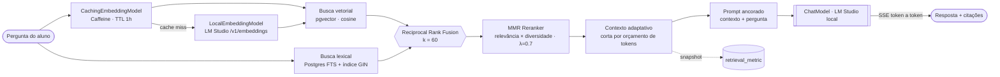

<h1 align="center">📚 Acervo</h1>

<p align="center">
  <strong>Plataforma de estudo com IA — RAG e ferramentas generativas rodando 100% local</strong>
</p>

<p align="center">
  <em>Converse com os seus próprios materiais, gere flashcards, quizzes e resumos,<br/>
  e estude com um tutor socrático — sem que um único byte saia da sua máquina.</em>
</p>

<p align="center">
  
  
  
  
  
  
</p>

<p align="center">
  <a href="#-o-que-este-projeto-demonstra">O que demonstra</a> •
  <a href="#-funcionalidades">Funcionalidades</a> •
  <a href="#-arquitetura-de-rag">Arquitetura de RAG</a> •
  <a href="#-ferramentas-de-estudo-generativas">IA Generativa</a> •
  <a href="#️-stack">Stack</a> •
  <a href="#-como-rodar">Como rodar</a>
</p>

---

## 📋 Visão geral

O **Acervo** é um assistente de estudo baseado em **RAG (Retrieval-Augmented Generation)**. O aluno organiza materiais por matéria, envia PDFs/DOCX/PPTX/MD, e o sistema os transforma numa base de conhecimento consultável: perguntas são respondidas **exclusivamente pelo conteúdo dos documentos**, com **citações rastreáveis** de onde cada informação veio.

O diferencial de arquitetura é a **privacidade por design**: tanto o modelo de **chat** quanto o de **embedding** rodam localmente via [**LM Studio**](https://lmstudio.ai/) (qualquer servidor compatível com a API OpenAI serve). Nenhum documento, pergunta ou dado pessoal é enviado para uma nuvem de terceiros — requisito real para material de estudo sensível, provas e pesquisa.

Além do chat com RAG, o Acervo gera **flashcards com repetição espaçada, quizzes, resumos multiníveis, mapas de tópicos** e conduz **sessões de tutoria socrática** — tudo ancorado nos documentos do próprio aluno.

---

## 🧠 O que este projeto demonstra

> Este repositório é, antes de tudo, uma demonstração prática de **engenharia de aplicações com LLMs** — do pipeline de RAG à avaliação, passando por prompt engineering e integração com modelos locais.

| Competência | Onde aparece no código |
|---|---|
| **Pipeline de RAG ponta a ponta** | ingestão → chunking → embeddings → indexação vetorial → retrieval → geração ancorada |
| **Retrieval híbrido** (denso + esparso) | busca vetorial `pgvector` **+** busca lexical `Postgres FTS`, fundidas por **Reciprocal Rank Fusion** |
| **Reranking com MMR** | `MmrReranker` equilibra relevância × diversidade (Maximum Marginal Relevance) |
| **Janela de contexto adaptativa** | corta o contexto por **orçamento de tokens** em vez de top-K fixo |
| **Embeddings com cache** | `CachingEmbeddingModel` (Caffeine) evita reembedar queries repetidas |
| **Streaming de tokens (SSE)** | resposta token a token com UI otimista, estilo ChatGPT/Claude |
| **Prompt engineering anti-alucinação** | *grounding* estrito ("responda só pelo contexto") + fallback honesto |
| **Geração estruturada + parsing robusto** | flashcards, quiz e mapas de tópicos parseados da saída do LLM |
| **Avaliação & observabilidade de retrieval** | métricas por consulta em `retrieval_metric` + histogramas Prometheus p50/p95/p99 |
| **IA local / privacidade** | integração OpenAI-compat apontando para LM Studio; nada sai da máquina |
| **Guardas de qualidade de ingestão** | detecção de PDF escaneado antes de indexar lixo sem texto |
| **Rigor de engenharia** | 49 testes com Testcontainers, CI, observabilidade, segurança e acessibilidade |

---

## ✨ Funcionalidades

### 🔎 Chat com RAG
- Respostas **ancoradas nos documentos** da matéria, com **painel de fontes** e barra de relevância por trecho.
- **Streaming SSE** token a token; a mensagem do usuário aparece na hora e a resposta do assistente vai sendo preenchida ao vivo.
- Fallback honesto — quando não há contexto suficiente, responde *"Não encontrei isso na nossa base de dados"* em vez de inventar.
- Cada resposta salva **citações rastreáveis** (documento + página) e o **tempo de geração**.

### 🤖 Ferramentas de estudo geradas por IA
- **Flashcards** com repetição espaçada **SM-2** (estilo Anki) gerados a partir do material.
- **Quizzes** de múltipla escolha com níveis de dificuldade.
- **Resumos multiníveis** por documento.
- **Mapa de tópicos** — visão dos conceitos de uma matéria.
- **Tutor socrático** — sessões de estudo multi-turno em que a IA pergunta, avalia a resposta e aprofunda.
- **Análise de lacunas** — sugere temas a revisar a partir do histórico de conversas do aluno.

### 🗂️ Organização & colaboração
- Matérias, upload por arrastar-e-soltar, ingestão assíncrona com status por documento.
- **Multiusuário** com autenticação real (Spring Security), **papéis** (`USER`/`ADMIN`) e **compartilhamento** de matérias entre usuários.
- Painel administrativo de usuários e **trilha de auditoria**.

---

## 🔎 Arquitetura de RAG

O coração do projeto. Em vez de um `similaritySearch` ingênuo, o retrieval combina busca densa e esparsa, reordena por diversidade e ajusta o contexto ao tamanho da pergunta:



**1. Retrieval híbrido + Reciprocal Rank Fusion.** A busca vetorial (`pgvector`, cosseno) roda **em paralelo** à busca lexical (`to_tsvector('portuguese', …)` + índice GIN) e os dois rankings são fundidos por **RRF (k=60)**. Resolve as queries com termos exatos onde a busca puramente semântica se perdia em paráfrase.

**2. Reranking com MMR.** O `MmrReranker` reordena o pool fundido por **Maximum Marginal Relevance** (`λ=0.7`, configurável), equilibrando relevância e diversidade para eliminar trechos redundantes.

**3. Contexto adaptativo.** Em vez de um top-K fixo, o contexto é cortado quando ultrapassa `max-context-tokens` (default 6000), mantendo um mínimo de trechos. Perguntas simples economizam tokens; perguntas complexas usam até o teto.

**4. Embeddings locais com cache.** O `LocalEmbeddingModel` fala direto com `/v1/embeddings` do LM Studio (contornando um bug do Spring AI 1.0.0-M3 que exige `usage != null`, que o LM Studio não preenche). Um `CachingEmbeddingModel` (`@Primary`, Caffeine, TTL 1h) evita reembedar queries repetidas.

**5. Geração ancorada + streaming.** O `RagService` monta um prompt com *grounding* estrito e transmite a resposta por **SSE** (`text/event-stream`). Ao final, um evento `done` traz as citações renderizadas no painel de fontes.

**6. Avaliação embutida.** Cada retrieval grava um snapshot em `retrieval_metric` (`chunks_retrieved`, `avg_distance`, `top1_distance`, `no_results`, `used_lexical_fusion`) — base para detectar regressões de qualidade via SQL.

> **Guarda de ingestão:** o `PdfExtractor` conta páginas com pouco texto extraível; se ≥70% estão "vazias", marca o documento como PDF escaneado (`FAILED`) e orienta rodar OCR — evitando indexar um PDF sem texto.

---

## 🤖 Ferramentas de estudo generativas

Todas ancoradas nos chunks do próprio aluno, orquestradas pelo `AiGenerationService` (wrapper sobre o `ChatModel` com montagem de prompt + tradução de erros):

| Ferramenta | Como funciona |
|---|---|
| **Flashcards (SM-2)** | LLM gera pares pergunta/resposta a partir de uma amostra de chunks; agendamento por **repetição espaçada** (`easeFactor`, `intervalDays`, `repetitions`, `dueAt`) estilo Anki |
| **Quiz** | Geração de questões de múltipla escolha com dificuldade selecionável; saída do LLM parseada em `QuizQuestion` |
| **Resumos** | Sumarização por documento em **níveis** distintos, respeitando orçamento de tokens de entrada |
| **Mapa de tópicos** | Extrai e estrutura os conceitos-chave de uma matéria (cacheado, com invalidação) |
| **Tutor socrático** | Sessão multi-turno: o tutor faz a pergunta inicial, avalia cada resposta do aluno e aprofunda (`StudySession` + `StudyTurn` com papéis `TUTOR`/`ALUNO`) |
| **Análise de lacunas** | Analisa o histórico de conversas do usuário e sugere temas a revisar por frequência |

---

## 🛠️ Stack

### IA & Retrieval
| Tecnologia | Papel |
|---|---|
| **Spring AI** 1.0.0-M3 | Abstração de `ChatModel`/`EmbeddingModel`/`VectorStore` (starter OpenAI → LM Studio) |
| **LM Studio** | Servidor de inferência local OpenAI-compat (chat + embedding) |
| **pgvector** (PostgreSQL 16) | Armazenamento e busca de vetores (cosseno) |
| **PostgreSQL FTS + GIN** | Busca lexical para o retrieval híbrido |
| **Caffeine** | Cache de embeddings de query |

**Modelos (default, trocáveis por env):** chat `gemma-2-9b-it` (ou `Qwen2.5-7B-Instruct`) · embedding `nomic-embed-text-v1.5` (768 dims). Para anexo de imagem, um modelo multimodal como `gemma-3-4b-it`.

### Aplicação
| Tecnologia | Papel |
|---|---|
| **Java 21 · Spring Boot 3.3** | Base da aplicação |
| **Spring Security** | Autenticação real (BCrypt), CSRF, papéis |
| **Thymeleaf** | UI server-side (sem SPA) — CSS/JS em arquivos separados |
| **Apache PDFBox / POI · commonmark** | Extração de texto de PDF, DOCX, PPTX, MD |
| **Spring Data JPA + Hibernate** | Persistência (schema por Hibernate + `SchemaBootstrap` para o que o JPA não cria) |

### Infra & Qualidade
| Tecnologia | Papel |
|---|---|
| **Docker / Docker Compose** | Postgres+pgvector (dev) e stack de produção |
| **Testcontainers** | 49 testes contra Postgres+pgvector efêmero |
| **Micrometer + Prometheus** | Métricas e histogramas de latência (p50/p95/p99) |
| **GitHub Actions** | CI: `mvn verify` + build/push da imagem (GHCR) |

---

## 🏗️ Estrutura

```
src/main/java/com/acervo/
├── ai/          # AiGenerationService — wrapper de geração (não-RAG) sobre o ChatModel
├── rag/         # RagService, LocalEmbeddingModel, CachingEmbeddingModel,
│                #   MmrReranker, EmbeddingPipeline, AiFailureTranslator
├── ingest/      # PdfExtractor, DocxExtractor, PptxExtractor, Chunker, ScannedPdfException
├── service/     # Study (tutor socrático), Quiz, Flashcard, Summary, TopicMap,
│                #   GapAnalysis, Subject, Document, Conversation, SubjectShare, User, Audit
├── domain/      # Subject, Document, Chunk, Conversation, Message, Citation, Flashcard,
│                #   QuizQuestion, DocumentSummary, StudySession, StudyTurn, RetrievalMetric, ...
├── controller/  # Chat, Import, Study, Quiz, Flashcard, Summary, TopicMap, Share, Admin, Auth
├── config/      # SecurityConfig, LmStudioHealthIndicator, SchemaBootstrap, WebConfig
└── repository/  # Spring Data JPA

src/main/resources/
├── application.yml + -dev + -prod        # perfis dev (local) / prod (env externas)
├── messages*.properties                  # i18n pt-BR (fallback en)
├── templates/                            # layout, chat, import, study, quiz, flashcards, ...
└── static/                               # css/acervo.css, js/acervo.js
```

---

## 📊 Observabilidade & avaliação

Métricas no formato Prometheus em `/actuator/prometheus`, com histogramas p50/p95/p99:

| Métrica | O que mede |
|---|---|
| `acervo_rag_answer_seconds` | Latência da resposta síncrona (`RagService.answer`) |
| `acervo_rag_answer_stream_seconds` | Latência total do streaming SSE (handshake → `done`) |
| `acervo_embedding_process_seconds` | Extrair + chunkar + embeddar + indexar um documento |

**Health check do LM Studio** — `GET /actuator/health/lmStudio` faz `GET /v1/models` com timeout de 2s e reporta `UP` (com `latencyMs`) ou `DOWN`, pronto para o healthcheck do Docker:

```bash
curl http://localhost:8080/actuator/health/lmStudio
# {"status":"UP","details":{"baseUrl":"http://localhost:1234","latencyMs":12}}
```

A tabela `retrieval_metric` guarda um snapshot por consulta — dá para medir qualidade de retrieval e detectar regressões via SQL ad-hoc.

---

## 🔐 Segurança

- **Autenticação real** com Spring Security: senhas em **BCrypt**, `formLogin`, papéis `USER`/`ADMIN` (`/admin/**` restrito).
- **CSRF** habilitado (token via cookie, compatível com o front sem SPA).
- **Upload validado:** máx. 50 MB, extensões em allow-list (`PDF/DOCX/PPTX/TXT/MD`), nome sanitizado contra XSS e *path traversal*, arquivo salvo como `{subjectId}/{uuid}.{ext}`.
- **Privacidade por design:** inferência local — documentos e perguntas não trafegam para provedores externos.
- **Trilha de auditoria** (`AuditLog`) para ações relevantes.

---

## 🚀 Como rodar

### Pré-requisitos
- **Java 21**, **Docker** e **[LM Studio](https://lmstudio.ai/)**.

### 1️⃣ LM Studio (modelos locais)
1. Em **Discover**, baixe (filtre por **GGUF**):
   - Chat: `Qwen2.5-7B-Instruct-GGUF` (Q4_K_M, ~4.5 GB) — ou outro de sua preferência.
   - Embedding: `nomic-ai/nomic-embed-text-v1.5-GGUF` (Q8_0, ~146 MB).
2. Em **Developer / Local Server**, carregue os **dois modelos** e suba o *context length* do chat para **≥ 16k**.
3. Inicie o servidor — confirme `http://127.0.0.1:1234`.

### 2️⃣ Banco (Postgres + pgvector)
```bash
docker compose up -d
```

### 3️⃣ Aplicação
```bash
mvn spring-boot:run
```
Abra **http://localhost:8080**.

> Trocou o modelo de chat no LM Studio? Ajuste `ACERVO_CHAT_MODEL` (ou `application-dev.yml`).

### Principais variáveis de ambiente
| Variável | Default | Descrição |
|---|---|---|
| `ACERVO_AI_BASE_URL` | `http://localhost:1234` | Servidor de inferência (Spring AI acrescenta `/v1/...`) |
| `ACERVO_CHAT_MODEL` | `gemma-2-9b-it` | Modelo de chat |
| `ACERVO_EMBEDDING_MODEL` | `…nomic-embed-text-v1.5@q8_0` | Modelo de embedding |
| `ACERVO_EMBEDDING_DIMENSIONS` | `768` | Dimensão do vetor (precisa bater com o modelo) |
| `STORAGE_DIR` | `./data/uploads` | Diretório dos arquivos enviados |
| `SPRING_PROFILES_ACTIVE` | `dev` | `dev` (local) · `prod` (env externas) |

### Produção (Docker)
`Dockerfile` multi-stage (Maven → JRE 21 slim, usuário não-root) + `docker-compose.prod.yml` (Postgres + app com volumes):
```bash
cp .env.example .env   # edite senha do Postgres e ACERVO_AI_BASE_URL
docker compose -f docker-compose.prod.yml up -d --build
```
> Em produção o LM Studio não roda no container — aponte `ACERVO_AI_BASE_URL` para um servidor OpenAI-compat na rede (Ollama, vLLM, llama.cpp) ou `http://host.docker.internal:1234` para alcançar o host.

---

## 🧪 Testes

**49 testes** cobrindo persistência, o pipeline de RAG (reranker MMR, cache de embeddings), ingestão (detecção de PDF escaneado) e o fluxo de chat ponta a ponta (incluindo **streaming SSE**). Rodam contra um Postgres+pgvector real via **Testcontainers** — sem mocks de banco.

```bash
mvn test      # testes
mvn verify    # testes + cobertura JaCoCo (mín. 60% em rag/ e ingest/)
```

Destaques: `RagServiceTest` (filtro por matéria, citações, fallback, `retrieval_metric`), `MmrRerankerTest` (diversificação), `CachingEmbeddingModelTest` (hit/miss), `PdfExtractorTest` (PDF escaneado), `ChatFlowIntegrationTest` (E2E síncrono + streaming).

---

## 🗺️ Roadmap

Ver [`Melhorias.md`](./Melhorias.md) — roadmap em fases: RAG mais inteligente (OCR na ingestão), produtividade do aluno, colaboração e novas features inteligentes (voz, geração assistida).

---

## 📄 Licença

Projeto pessoal de portfólio. Sinta-se à vontade para explorar o código.

---

## 👨‍💻 Autor

Desenvolvido por **Wallace Campista** — engenharia de aplicações com LLMs, RAG e IA local.

---

<p align="center">
  
  
</p>
